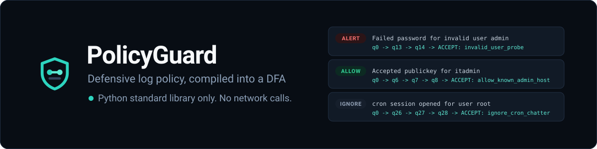
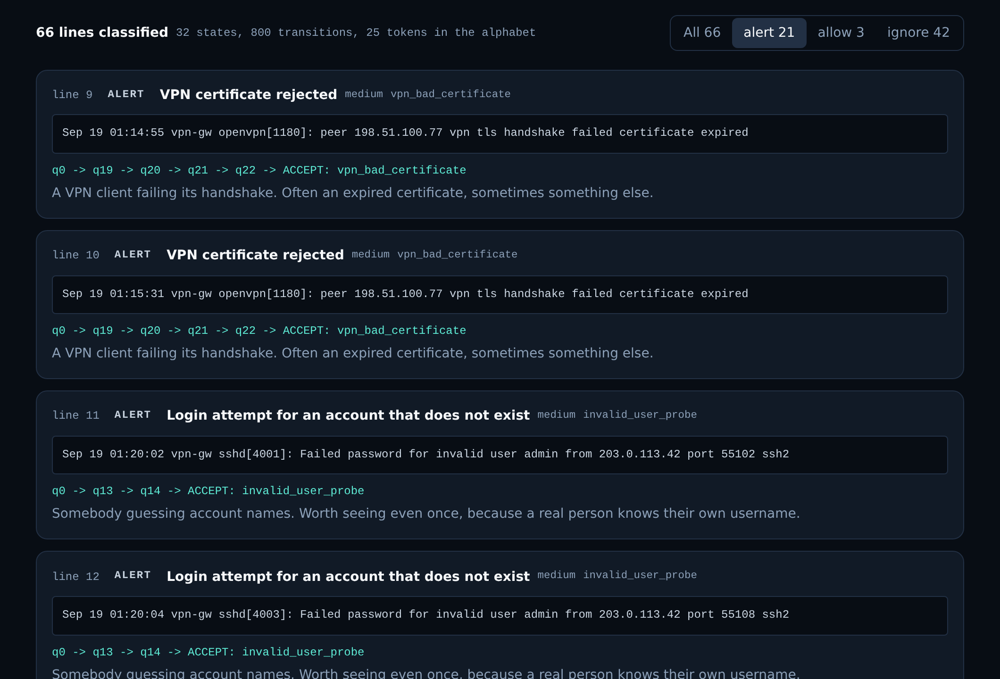

<p align="center">
  
</p>

<p align="center">
  <a href="https://github.com/IgorCSIS/policyguard/actions"></a>
  
  
  
</p>

# PolicyGuard

A defensive log classifier. It compiles a pack of policy rules into a
deterministic finite automaton, runs log lines through it, and labels every
line `allow`, `alert`, or `ignore` along with the automaton path that produced
the label.

**Live demo:** https://igorcsis.github.io/policyguard/  
**Core engine:** Python 3.10 or newer, standard library only, no `pip install`

```
$ python -m policyguard --explain
 LINE  DECISION  RULE                      EVENT
-----------------------------------------------------------------
   15  alert    brute_force_ssh           Sep 19 01:20:11 vpn-gw sshd[4009]: Failed password for ...
        path: q0 -> q10 -> q11 -> q12 -> ACCEPT: brute_force_ssh
        why:  Five or more failed SSH passwords from one address inside a short
              window. Fired after 5 matching events from one source.
```

<p align="center">
  
</p>

## What PolicyGuard is, and what it is not

**It is** a classifier and a demonstration project. It reads text, decides
what each line means according to a rule pack you can read and edit, and shows
its working. It exists to show hash tables, queues, graphs and algorithmic
complexity doing real work on a real problem, rather than in an exercise.

**It is not** a security product, and it deliberately cannot become one:

- It has **no network code at all.** The engine and the CLI read files and
  write to standard output. Nothing here opens a socket.
- It **does not block, scan, probe, or contact anything.** It has no
  enforcement side and no remediation side.
- It contains **no attack tooling.** No exploits, no password cracking, no
  scanning, no payloads. Every rule in the shipped pack is a defensive
  signature: a description of something worth noticing in a log.
- The sample log is **synthetic.** Invented hostnames, invented accounts, and
  addresses from the ranges reserved for documentation. There is no real
  personal data in this repository.

It is also not a claim that anything was prevented. It classifies a text file.

## Stack decision

| Layer | Choice | Why |
| --- | --- | --- |
| Engine | Python 3.10+, standard library only | Runs anywhere Python is, with no install step and nothing to keep up to date |
| Structures | `dict` for the transition table, `deque` for BFS and for the sliding window | Chosen because they are the right tool here, not bolted on |
| Rules | JSON | Readable and editable by somebody who does not write Python, and `json` is in the standard library |
| CLI | `argparse`, `python -m policyguard` | Demos on any machine with Python and nothing else |
| Tests | `unittest` | Standard library, so `python -m unittest` works everywhere |
| Demo UI | Vite, TypeScript, Tailwind | Free static hosting on GitHub Pages, and a port that a parity check keeps honest |
| Hosting | GitHub Pages via Actions | Zero cost on a public repository, with no account or key to configure |

No language model is involved anywhere. The classification is deterministic:
the same log and the same pack always produce the same answers.

## Running it

### The command line tool

```bash
python -m policyguard                          # the shipped sample and pack
python -m policyguard /var/log/auth.log        # your own log
python -m policyguard --explain                # show the state path and the reason
python -m policyguard --only alert             # triage view
python -m policyguard --json                   # machine readable, used by the parity check
python -m policyguard --stats                  # report the compiled automaton size
python -m policyguard --fail-on-alert          # exit 2 if anything alerted, for a CI gate
python -m policyguard -p policies/baseline.json --dot automaton.dot
cat auth.log | python -m policyguard -          # read standard input
```

No installation step. Clone the repository and run it from the root.

### The tests

```bash
python -m unittest discover -s tests -t .      # 106 tests
python tools/appendix_a_audit.py policyguard tools tests
```

106 tests covering compilation, all three decisions, precedence, threshold
windows, empty input, unknown tokens, path explain, the DOT export, both
reporters, every rule pack error, and the CLI exit codes. CI runs them on
Python 3.10, 3.11, 3.12 and 3.13.

The second command is the style checker. Conventions that live only in a
document drift, so `tools/appendix_a_audit.py` walks the package with `ast`
and fails if anything disagrees with Appendix A: a missing docstring, a
missing Parameters or Returns section, a public attribute that should be
private behind a property, a constant without `Final`, a class without
`__str__`. It runs in CI, and it has its own tests, including one that feeds
it a deliberately broken module and checks every rule still fires. A linter
nobody tests is a linter that has been quietly loosened until it passes.

## The data structures, and what they cost

### Hash table: the transition function

The automaton's transition table is a `dict` keyed by `(state, token)`. That
is the single decision the whole complexity argument rests on. Looking up
"from state 7, having read the word `password`, where do I go" is one average
constant-time hash lookup, not a walk along a list of edges.

The shipped pack compiles to **32 states over an alphabet of 25 tokens, giving
800 entries**: every state has exactly one answer for every token it could
possibly read.

### Queue: two of them, doing different jobs

`collections.deque` appears twice, and the two uses are worth telling apart.

1. **Building the automaton.** Failure links are computed by a breadth-first
   walk of the trie. The queue is what makes it breadth first, and breadth
   first is what makes it correct: a state's failure link can only be computed
   once its parent's is known, and a queue visits parents before children by
   construction.
2. **Sliding windows.** A threshold rule like "five failed passwords from one
   address" keeps a queue of recent hit positions per source. New hits join
   the back, stale ones leave the front, and both are constant time. A list
   would make the removal linear, for no benefit.

### Graph: the automaton itself

The automaton is a directed graph. States are vertices, transitions are
labelled edges. Two things fall out of treating it as one:

- **The path explain feature.** Every verdict carries the sequence of states
  that spell out the matching rule, printed as `q0 -> q4 -> q7 -> ACCEPT:
  rule_id`. A decision you cannot retrace is a decision you cannot trust.
- **`--dot`** writes the graph as Graphviz DOT. Nothing needs Graphviz
  installed to run or to test; the tool emits text and whether anybody draws
  it is their business.

### Big-O

Let `n` be the number of log lines, `m` the average tokens per line, `r` the
number of rules, `t` the total tokens across all rule patterns, `k` the size
of the token alphabet, and `z` the number of matches reported.

| Operation | Cost | Note |
| --- | --- | --- |
| Compile the trie | `O(t)` | One pass per rule pattern |
| Compute failure links | `O(states * k)` | The BFS visits each state once and considers each token |
| Classify one line | `O(m + z)` | One table lookup per token |
| **Classify a whole log** | **`O(n * m + z)`** | **Independent of `r`** |
| Threshold window update | `O(1)` amortized | Only the front of the queue can be stale |
| Memory | `O(states * k + n_sources * window)` | Table plus the live windows |

The row that matters is the bolded one. **Classification does not
get slower as rules are added.** The naive approach, checking every rule
against every line, is `O(n * m * r)`. Compiling all the rules into one
automaton first replaces the `r` with a one-time `O(t)` build. Ten rules or
ten thousand, a line still costs one lookup per word.

The trade is memory: completing the transition table costs `states * k`
entries. For the shipped pack that is 800, which is nothing. For a pack with a
very large alphabet it would be the thing to reconsider first, and the fix is
to store only the trie edges and follow failure links at match time, trading
that memory back for a slower constant factor.

## Why it is built this way

Log triage is a good problem to build carefully. The obvious solution, check
every rule against every line, is obviously too slow, and the fast solution is
a finite automaton, which is a structure you can draw on a whiteboard and then
explain to somebody.

What the code demonstrates, and where to look for each:

- **Abstract data types.** `Event`, `Rule`, `Transition`, `Automaton`,
  `PolicyEngine`, `Verdict`, and `Alert` each own one idea. Attributes are
  private with read-only properties, because a verdict that could be edited
  after the fact is not a record of anything, and a rule that could change
  after compilation would make the compiled automaton a lie.
- **Abstraction and polymorphism.** `Reporter` is an abstract base class with
  no default `render`, so a subclass that forgot to implement it cannot be
  instantiated at all rather than silently producing nothing. `TableReporter`
  and `JsonReporter` implement it, and the CLI holds one without knowing
  which. Adding a CSV format means writing one class and adding one registry
  entry; nothing in `cli.py` changes.
- **Hash tables** as the transition function, with the complexity argument
  that follows from average constant-time lookup.
- **Queues** in two genuinely different roles, construction and sliding
  windows, rather than one queue used once for show.
- **Graphs**, as the automaton, with traversal for the explain output and an
  export to a standard graph format.
- **Algorithmic complexity** as a design driver, with the naive alternative
  written down so the improvement is measurable rather than asserted.
- **Conventions that are checked rather than claimed**, by a style auditor
  with its own tests. See `tools/appendix_a_audit.py`.
- **A security application** that stays strictly defensive, which is both the
  right choice and the more interesting engineering problem: the hard part of
  detection is not matching, it is precedence and noise.

The most instructive bug found while building it is in the git history: the
sample log contains cron sessions for root, and the "interactive root shell"
rule matched every one of them. The fix was not a code change. It was a
priority on the cron rule, which is exactly how a real detection gets tuned,
and there is now a test holding that behaviour in place.

## How the browser demo works

`web/` is a Vite, TypeScript and Tailwind page that runs the same
classification in the browser. Paste log lines or load the sample, and every
line comes back with its decision, its rule, and its state path.

It fetches the rule pack and the sample from its own folder on load, and after
that it makes no requests at all. **Whatever you paste stays on your device.**
There is no account, no key, and no upload.

### Parity: why the demo is trustworthy

Two implementations of the same rules will drift. `src/lib/` in the web app is
a port of the Python, and **the Python is the source of truth for rule
semantics.** To keep that claim honest:

```bash
cd web && npm install && npm run parity
```

```
Parity OK: 66 verdicts identical in TypeScript and Python (3 allow, 21 alert, 42 ignore).
```

The check runs the Python CLI with `--json` and the TypeScript engine over the
same pack and the same log, then compares every field of every verdict:
decision, rule, severity, state path, reason, and source. One character of
difference fails the run with both values printed. CI runs it on every push,
so a drifting port breaks the build rather than surprising somebody mid-demo.

The rule pack and the sample log are **not** copied into `web/`. They are
synced from `policies/` and `samples/` before every build by
`web/scripts/sync-fixtures.mjs` and are git-ignored, so there is exactly one
copy of each in the repository.

```bash
cd web
npm install
npm run dev       # http://localhost:5173/policyguard/
npm run build     # typecheck, then a static site in dist/
npm test          # the TypeScript tests
npm run parity    # prove the port agrees with Python
```

## Writing your own rules

A rule pack is JSON. Every rule needs an `id`, a `decision`, and a `pattern`.

```json
{
  "id": "brute_force_ssh",
  "label": "Repeated SSH password failures",
  "decision": "alert",
  "severity": "high",
  "pattern": ["failed", "password", "for"],
  "threshold": 5,
  "window_seconds": 20,
  "description": "Five or more failed SSH passwords from one address in a short window."
}
```

| Field | Meaning |
| --- | --- |
| `id` | Unique within the pack. Appears in every report line |
| `decision` | `allow`, `alert`, or `ignore`. Anything else is refused at load time |
| `pattern` | Token sequence to look for. A string is split on spaces |
| `priority` | Higher wins when several rules match. Defaults by decision |
| `severity` | `info`, `low`, `medium`, or `high`. Only meaningful on alerts |
| `threshold` | Matches needed before the rule fires. Default 1 |
| `window_seconds` | How wide the sliding window is, counted in **events**, not clock time. See the note below |
| `description` | One line of prose, shown as the reason |

Matching is on normalized tokens, so case and log punctuation do not matter.
`sshd[4001]:` becomes `sshd` and `4001`.

### `window_seconds` counts events, not seconds

Worth being blunt about, because the field name promises more than the code
does today. A rule with `"threshold": 5, "window_seconds": 20` fires when five
matching lines appear from one source within **twenty events** of each other in
the stream, not within twenty seconds on the clock. Nothing parses the
timestamp on a line.

That is deliberate rather than unfinished. Log timestamp formats vary
enormously, and parsing them badly would produce a window that is wrong in
ways nobody notices. Counting events is a weaker guarantee that is always
true. The field keeps the name because that is what it will mean once
timestamps are parsed, and this paragraph exists so nobody has to read the
source to find that out.

### Precedence, and the one sharp edge

Several rules can match one line, so one has to win. **The highest priority
match wins, and equal priorities break the tie by order in the pack.**

By default `allow` is priority 100, `alert` is 50, and `ignore` is 10, which
means **an explicit allow outranks an alert.** That is the behaviour an allow
list is expected to have: once you have written down that a pattern is your
own backup job, it should stop paging you. It is also the sharpest edge in the
design, which is why it is stated here, in the CLI help, and in the code.

Setting `priority` explicitly is how a noisy detection gets tuned. The shipped
pack does exactly that for cron sessions, and there is a test holding it.

## Layout

```
policyguard/
  event.py          one log line, parsed and normalized into tokens
  rule.py           rules, rule packs, decisions, and pack validation
  transition.py     one labelled edge, for explain output and DOT export
  automaton.py      the DFA: trie, failure links, goto completion, matching
  engine.py         precedence, sliding windows, and the verdict stream
  alert.py          Verdict for every line, Alert for the ones that matter
  report.py         the Reporter abstraction, and the table and JSON formats
  cli.py            argparse interface, flag parsing, and exit codes
  errors.py         the errors this package raises on purpose
policies/           rule packs as JSON
samples/            synthetic log lines
tests/              unittest, including tests for the style checker
tools/              the Appendix A audit and the social card generator
assets/             logo, banner, screenshot, and the social card source
docs/DESIGN.md      the automaton model, worked by hand
web/                the browser demo, with the parity check
```

Every Python module follows the Appendix A conventions: snake_case names,
`Final` on constants, a leading underscore on anything private, docstrings on
every module, class, and function with Parameters, Returns and Raises
sections, and encapsulation through properties rather than public attributes.
That is not a promise, it is a check: run `python tools/appendix_a_audit.py`
and it either prints nothing or tells you exactly which line disagrees.

## Defensive scope

This project classifies text. That is the entire scope, and it is a deliberate
boundary rather than an unfinished feature.

It will not gain an enforcement mode, a scanning mode, or any capability that
acts on a host. If you want to act on what it finds, read the output and
decide for yourself. A tool that reads a log and files it into three piles is
useful precisely because a person stays in the loop.

An optional offline explanation feature using a locally run model is possible
later. It would remain optional, and the live demo would keep working with no
keys and no network, because that is the property that makes this safe to hand
to somebody.

## License

MIT. See [LICENSE](LICENSE).

Built by Igor Lima. Python automation for East County and San Diego
businesses. Portfolio: https://igorcsis.github.io/niftyai-portfolio/
